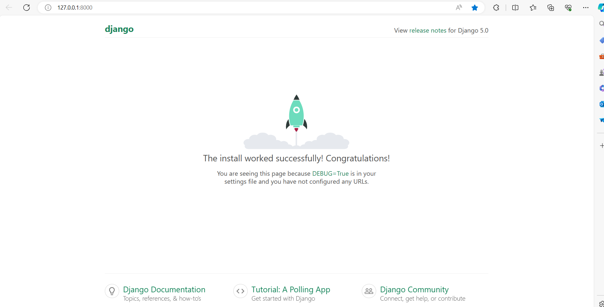
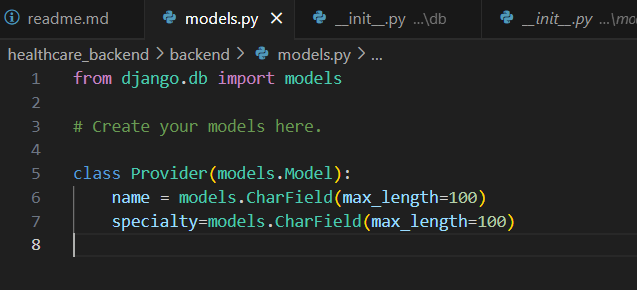
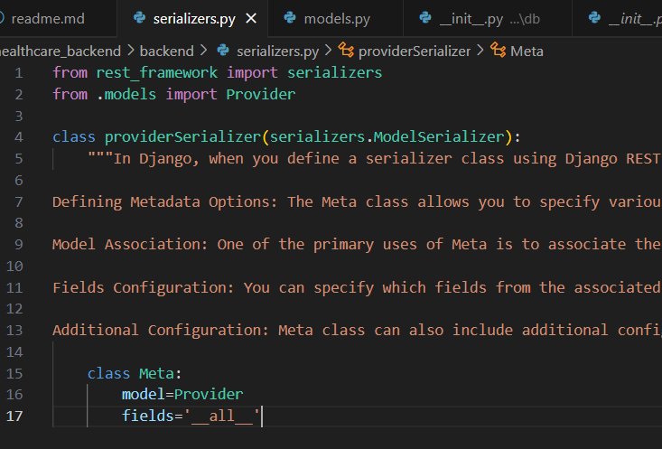
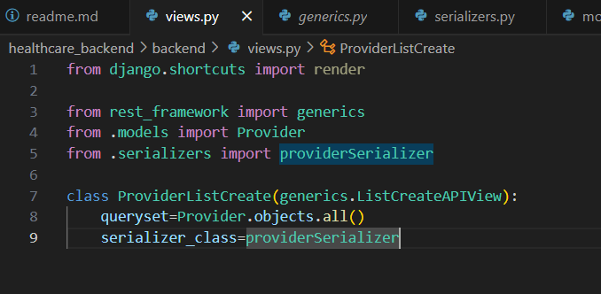
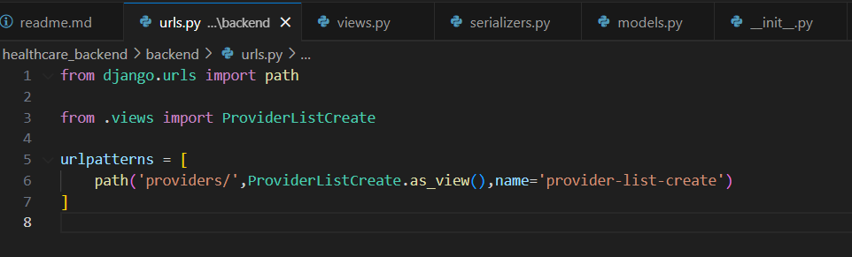
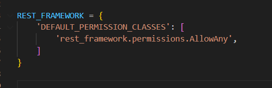
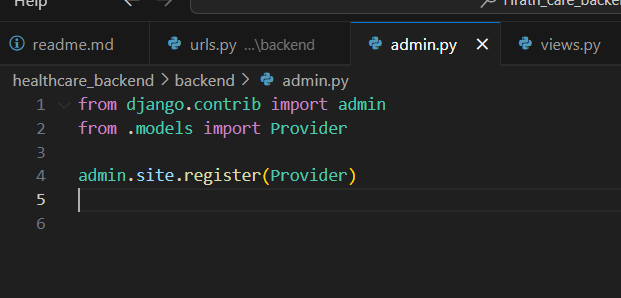
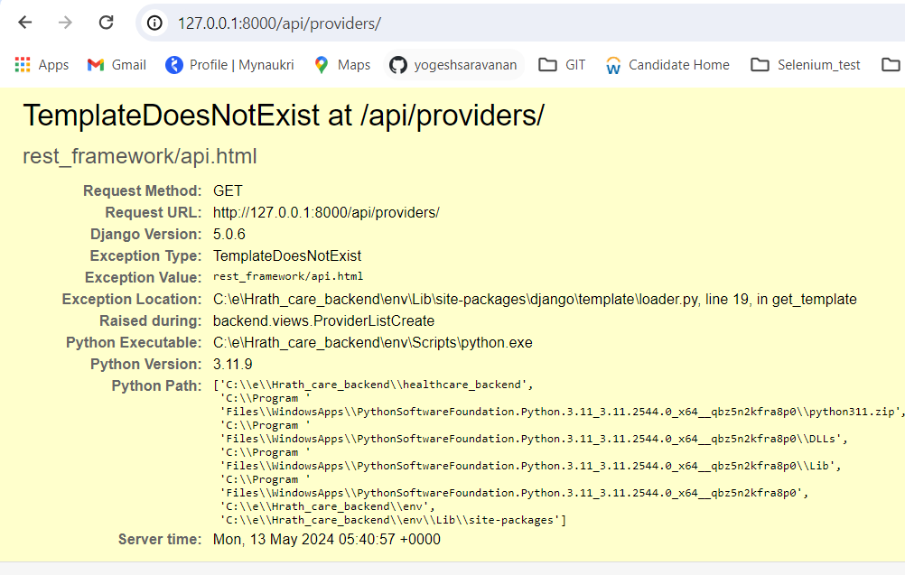
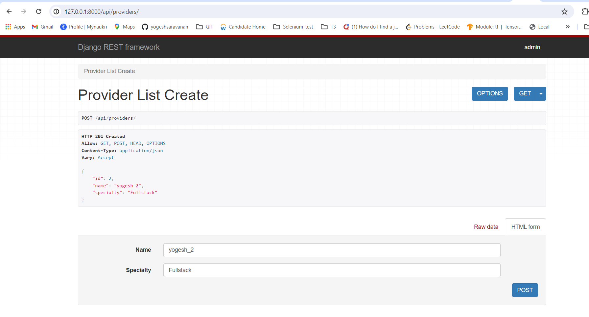
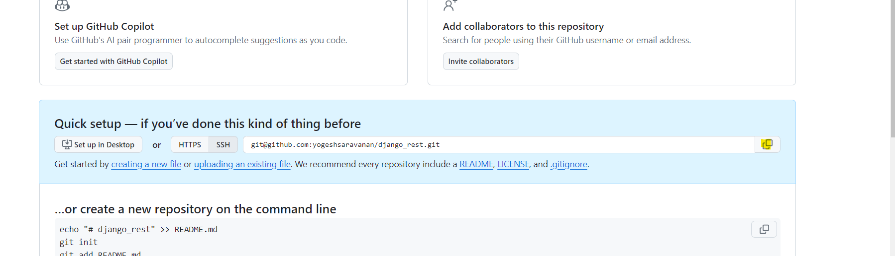

python -m venv env  - createing avirtual environment

env/Scripts/activate - activation the virtual environment

pip install django djangorestframework  - installing django and rest

django-admin startproject healthcare_backend  - creating a backend 

cd healthcare_backend - going into the directory

django-admin startapp backend - creating am app backend

upadete the healthcare_backend/settings.py installed apps with the app create 'backend'

INSTALLED_APPS = [
    'django.contrib.admin',
    'django.contrib.auth',
    'django.contrib.contenttypes',
    'django.contrib.sessions',
    'django.contrib.messages',
    'django.contrib.staticfiles',
    'backend'
]

pythom manage.py runserver  - for running the code

  

created a file urls.py in the backend

Define Models:
Define Django models to represent the data structure of your healthcare application. Models define the database schema and are used to interact with the database.

Learn more about django models here https://docs.djangoproject.com/en/5.0/topics/db/models/

overview of model 
1.Generally, each model maps to a single database table.

The basics:

Each model is a Python class that subclasses django.db.models.Model.
Each attribute of the model represents a database field.
With all of this, Django gives you an automatically-generated database-access API; see Making queries.

created a model.py in backend

3. Create Serializers:
Serializers in Django REST Framework convert Django model instances into JSON data that can be easily rendered into HTTP responses. Define serializers to specify the representation of your models in API responses.

read more about serializers here https://www.django-rest-framework.org/api-guide/serializers/

created a file backend/serializers.py

4. Create Views (API Endpoints):
Create views using Django REST Framework's class-based views or function-based views. Views define the behavior of your API endpoints and handle requests from clients.

A view function, or view for short, is a Python function that takes a web request and returns a web response. This response can be the HTML contents of a web page, or a redirect, or a 404 error, or an XML document, or an image . . . or anything, really. The view itself contains whatever arbitrary logic is necessary to return that response. This code can live anywhere you want, as long as it’s on your Python path. There’s no other requirement–no “magic,” so to speak. For the sake of putting the code somewhere, the convention is to put views in a file called views.py, placed in your project or application directory

read more about views here https://docs.djangoproject.com/en/5.0/topics/http/views/

5. Define URLs:
Define URL patterns to map API endpoints to views. Configure the URLs in Django's urls.py file.

Learn mnore about django urls here: https://docs.djangoproject.com/en/5.0/ref/urls/

adding the backend/urls.py in the healthcare_backend/urls.py 

    path('api/',include('backend.urls'))

created the backend/urls.py 

updated the setting.py with the rest_framewoerk

In your Django project's admin.py file, you typically register your models with the Django admin interface to manage them through a web-based administrative interface. Here's what you might need to update in admin.py for your Django REST Framework (DRF) project:

Register Models:
If you have models defined in your Django app that you want to manage via the Django admin interface, you need to register them using the admin.site.register() function. This allows you to perform CRUD (Create, Read, Update, Delete) operations on your models from the Django admin site.

python manage.py makemigrations

python manage.py migrate

python manage.py runserver

getting error TemplateDoesNotExist

create a super user and check the functions are working

python manage.py createsuperuser

username: admin
pass:admin@2024

after updating the admin.py '

and in setting.py         'APP_DIRS': True,

it is working

Git commands

init      Create an empty Git repository or reinitialize an existing one

git init 

Initialized empty Git repository in C:/e/Hrath_care_backend/healthcare_backend/.git/

git add .

added all files

git commit -m 'creatd code for provider'

[master (root-commit) f1899c9] creatd code for provider
 30 files changed, 284 insertions(+)

 got git hub and create a now repo and copy the ssh key of that repo 

 git@github.com:yogeshsaravanan/django_rest.git

 git remote add origin git@github.com:yogeshsaravanan/django_rest.git

 git push -u origin master